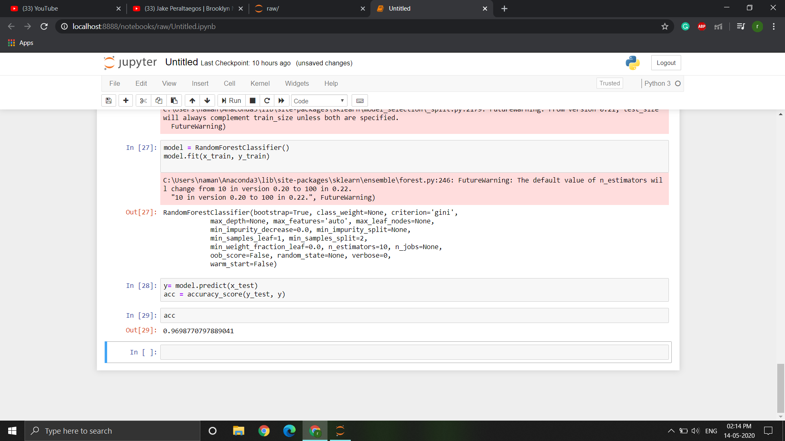

# PrithviAI-challenge

## About Data
The raw sensor data is located in the directory. Each user has its own data file which is tagged with their
subject id, the sensor, and the device. Within the data file, each line is:

**Subject-id, Activity Label, Timestamp, x, y, z**
The features are defined as follows:
**subject-id**: Identifies the subject and is an integer value between 1600 and 1650.
**activity-label**: see Table 2 for a mapping from 18 characters to the activity name
**timestamp**: time that the reading was taken (Unix Time)
**x**: x sensor value (real valued)
**y**: y sensor value (real valued)
**z**: z sensor value (real valued)

## Accuracy

